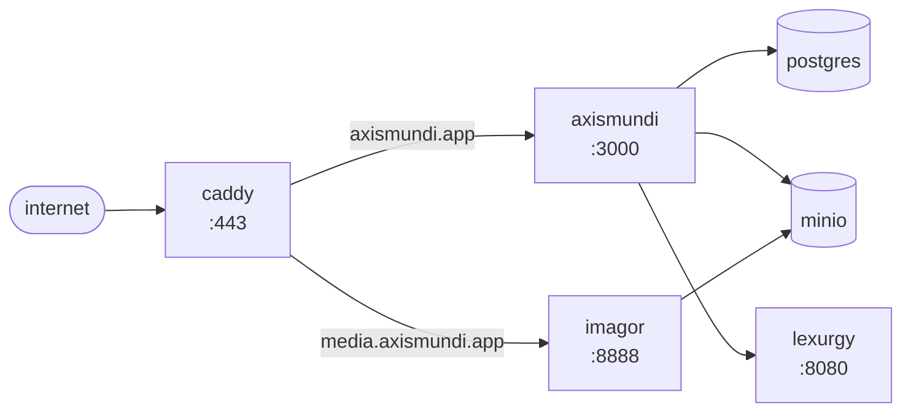

# Deploying Axismundi

We distribute a number of OCI containers via our Nix flake for deployment. The
canonical deployment happens on a NixOS box, with backups going to Backblaze.

The Nix module bundles the app, postgres, minio, imagor, and lexurgy into one
unit, plus optional caddy + automated backups. supporting services run as
podman containers regardless of how the app itself is deployed.



Services other than Axismundi itself are always run and built as Podman
containers. The Nix module adds these to any given system flake. The app can be
run in one of three ways:

1. Local
  - This finds an `axismundi:local` image on the same machine and runs it
    with the other services. This is useful if you don't want the version
    of Axismundi to be tied to updating your system's configuration.
  - To use this, include `services.axismundi.source = "local"` in your
    flake.
2. Via registry
  - This finds a given tag on a given registry and runs it, matching the
    other containers. This is useful if you want to entirely encapsulate
    Axismundi as an external service.
  - To use this, include `services.axismundi.source = { registry; tag; }`
    in your flake, providing a registry and tag.
3. Via package
  - This builds Axismundi via Nix and runs it as an OCI container. This
    is useful if you want a fully nix-managed app.
  - To use this, include `services.axismundi.source = { package; }` in
    your flake, providing the package to use. We provide an official
    Nix package through our flake.

## Initial host setup (Nix)

### 1. Consume the module from a system flake

```nix
{
  inputs = {
    nixpkgs.url = "github:NixOS/nixpkgs/nixos-unstable";
    axismundi.url = "github:auctumnus/axismundi";
  };
  outputs = { nixpkgs, axismundi, ... }: {
    nixosConfigurations.poweredge = nixpkgs.lib.nixosSystem {
      system = "x86_64-linux";
      modules = [
        axismundi.nixosModules.default
        ./configuration.nix
      ];
    };
  };
}
```

### 2. Configure the service

This is a minimum-viable example configuration block. See `nix/module.nix`
for the full option set.

```nix
services.axismundi = {
  enable = true;
  source = "local";  # or { registry = "..."; tag = "..."; } / { package = ...; }

  config = {
    publicUrlBase = "https://axismundi.app";
    environment = "Prod";

    s3 = {
      accessKey.file    = "/etc/axismundi/s3-access-key";
      secretKey.file    = "/etc/axismundi/s3-secret-key";
      imagorSecret.file = "/etc/axismundi/imagor-secret";  # required in prod
    };
    lexurgy.apiKey.file = "/etc/axismundi/lexurgy-key";
    email.resend = {
      apiKey.file = "/etc/axismundi/resend-key";
      fromEmail   = "noreply@axismundi.app";
    };
  };

  postgres.password.file = "/etc/axismundi/pg-password";

  caddy = {
    enable      = true;
    domain      = "axismundi.app";
    mediaDomain = "media.axismundi.app";
  };

  backup = {
    enable = true;
    offsite = {
      enable     = true;
      configFile = "/etc/axismundi/backup.json";  # see docs/backups.md
    };
  };
};
```

### 3. Configure secrets

For any option which is a secret, you can either set it via the `.value`
property or by the `.file` property. The `.value` property will leak your
secrets to the Nix store. `.file` can be used either with regular files on
your disk, specified by absolute paths, or with secret files using a secrets
management solution like [`agenix`](https://github.com/ryantm/agenix) or
[`sops-nix`](https://github.com/mic92/sops-nix).

```bash
sudo install -d -m 0700 /etc/axismundi
sudo install -m 0400 /dev/stdin /etc/axismundi/pg-password    # paste, ctrl-d
sudo install -m 0400 /dev/stdin /etc/axismundi/s3-access-key  # ...etc
```

### 4. First activation

```bash
sudo nixos-rebuild switch --flake .
```

This creates the `axismundi` podman network, creates the config file, spins up
the other services, and initializes them. If the local source is being used,
it will also wait for an image named `axismundi:local` to appear before the
app container can start.

### 5. Create the app image

```bash
git clone https://github.com/auctumnus/axismundi /opt/axismundi
cd /opt/axismundi
podman build -t axismundi:local .
sudo systemctl restart podman-axismundi.service
```

## Updating (local source)

The deploy script handles regular updates for you.

```bash
just deploy
# or, equivalently, from anywhere with the flake:
nix run .#deploy-local
```

`scripts/deploy.sh` does, in order:

1. **Fresh backup** of the live db (skip with `--no-backup`)
2. **Dry-run pending migrations** against an ephemeral copy of that backup
   — see `docs/backups.md`. if any migration fails to apply, the deploy
   aborts here, before anything has touched prod
3. **podman build** the new `axismundi:local` image from the working tree.
   ordered before the migration apply so a build failure doesn't leave
   prod's db ahead of the still-running old binary
4. **Stop** `podman-axismundi.service` so the old binary never serves
   traffic against a schema it wasn't built for (skip with `--no-restart`,
   in which case the migration applies with the service still running)
5. **Apply migrations** to prod via `sqlx migrate run`
6. **Start** `podman-axismundi.service` (skip with `--no-restart`)
7. tail the last 30 lines of journal for that unit so you can eyeball the
   boot

A minimal update looks like this:

```bash
ssh poweredge
cd /opt/axismundi
git pull
just deploy
```

### Rollback

If there's some problem with the new version, you can rollback the app binary
by re-tagging a previous image as `axismundi:local`:

```bash
# previous image is still in podman's store, tagged by digest
podman images axismundi --format '{{.Tag}} {{.ID}} {{.Created}}'
podman tag <previous-id> axismundi:local
sudo systemctl restart podman-axismundi.service
```

If the database has a problem, you'll need to restore from backup. Luckily,
the deploy script already took a backup for you! See
[`docs/backups.md`](/docs/backups.md).

## Updating (via registry)

Here, to update, you need only update the tag used in your flake.

```nix
services.axismundi.source = {
  registry = "ghcr.io/auctumnus/axismundi";
  tag      = "v1.4.2";
};
```

```bash
sudo nixos-rebuild switch --flake .
```

## Updating (via package)

Here, to update, you'll likely want to update your flake with
`nix flake update`, and then `sudo nixos-rebuild switch --flake .`.

In this mode the app runs as a host-side systemd service (`axismundi.service`)
under a dedicated `axismundi` user, not as a podman container. The supporting
containers still run via podman, but their ports get published on
`127.0.0.1` so the host-side app can reach them — the module sets the
endpoint defaults (`s3.endpoint`, `lexurgy.url`) accordingly.

## Caddy reverse proxy

`caddy.enable = true` declares two virtualhosts:

- `<domain>` → reverse-proxies to the app, with a fallback that serves
  `nix/fallback.html` during restarts or downtime
- `<mediaDomain>` (optional) → reverse-proxies to imagor

Set `config.s3.publicUrlBase = "https://media.axismundi.app"` so the app
generates image URLs against the public media domain instead of the internal
imagor address.

If you already have a host-side reverse proxy, set `caddy.enable = false`;
you can reverse-proxy to the app and imagor on localhost using the ports you
set in the config.

## external database

`postgres.enable = false` to use a managed db instead of the sibling
container. Provide the full DATABASE_URL via `postgres.databaseUrl.file`
(supersedes `postgres.password`):

```nix
services.axismundi.postgres = {
  enable        = false;
  databaseUrl.file = "/etc/axismundi/database-url";
};
```

The file should contain a single line like
`postgres://user:pw@host:5432/axismundi`. The module skips the local
postgres container and the bucket-init oneshot in this mode, but everything
else stays the same.

## gotchas

- **secret rotation.** the module's `restartTriggers` track *paths* to
  secret files, not their *contents*. if you edit a file in place, run
  `sudo systemctl restart axismundi-config.service` then restart the
  consuming containers (`podman-axismundi.service`,
  `podman-axismundi-postgres.service`, etc).
- **`source = "local"` plus `nixos-rebuild` on a fresh box** will fail to
  start the app container until you've run `podman build -t axismundi:local`
  at least once. the dependency is intentional: the unit has
  `--pull=never` so a typo in the tag doesn't silently fall back to docker
  hub.
- **`IMAGOR_UNSAFE`.** if `config.s3.imagorSecret` is unset, imagor runs
  with `IMAGOR_UNSAFE=1`, which lets anyone request arbitrary transforms
  on arbitrary URLs. fine for dev. **never deploy prod without the secret
  set.**
- **bucket lifecycle.** the module creates the minio bucket if missing
  but doesn't manage retention. for offsite (b2) backups, set lifecycle
  rules in the b2 web UI — see `docs/backups.md` "b2 key capabilities".
- **journal noise.** every container logs to journald with 30-day
  retention / 2G cap (`services.journald.extraConfig`). bump it via
  `mkForce` if you want longer history.
- **first-deploy-of-the-day cold start.** on the `local` path, `podman
  build` rebuilds rust + the frontend from scratch in a fresh container.
  this takes minutes. nothing to do about it short of switching to the
  `package` source, which gets nix's incremental + cached builds.

## Healthchecks

```bash
sudo systemctl status podman-axismundi.service        # or axismundi.service in package mode
sudo journalctl -u podman-axismundi.service -f
curl -fsS https://axismundi.app/api/health
```

`/api/health` returns json:

```json
{ "status": "ok", "checks": { "db": "ok", "s3": "ok" } }
```

- `200 OK` with `status: "ok"` — everything is reachable
- `200 OK` with `status: "degraded"` — app + db are up, but s3 is unreachable.
  text content still works; image uploads / image urls don't
- `503 Service Unavailable` — db is unreachable. the app can't function;
  caddy serves the fallback page on the next request

Caddy logs go to journald under `caddy.service`. If the public domain is
serving the fallback page, the app container is the thing that's wrong, not
caddy.
