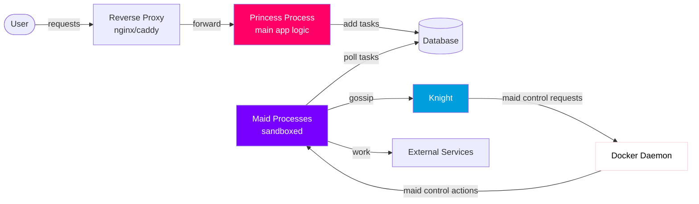
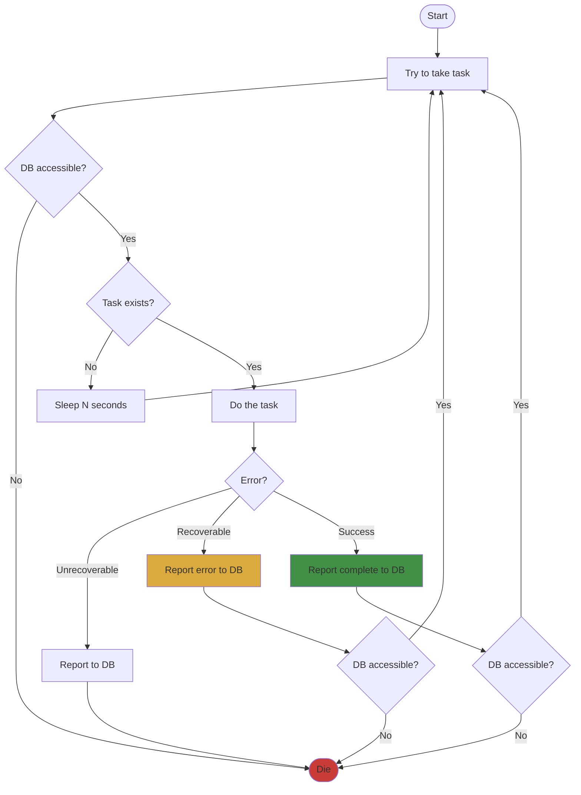
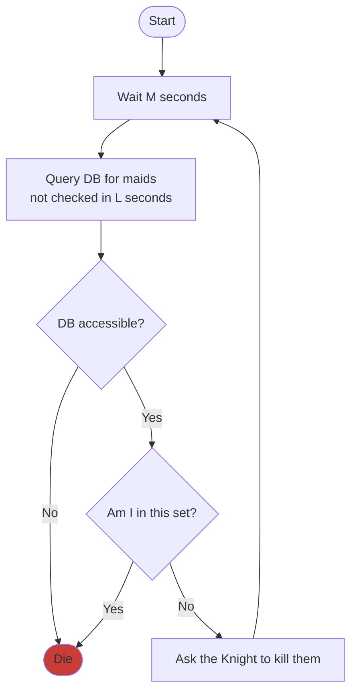

# tasks

the server has to do a couple kinds of tasks which range from "we don't want to block a request" to
"we don't want this to live in the main process because parsing is CVEful" to "we might want to retry
on failure".

in general, our structure is:

- the reverse proxy takes in queries from users, does https, etc
- the princess process does all the "complicated logic", incl. routing
- the database stores user data, as well as tasks and references to maid processes
- maids do tasks

## the life of a maid

a maid is created by God (docker or whatever), and then goes to find her princess. she checks in with the database,
making a row for herself, and then starts 2 {tokio task, thread, something}s, a "work loop" and a "gossip loop".

for some timeout values N < M < L:

### work loop

1. try to take a task
2. if there is no task, sleep for N seconds and goto 1
3. try to do the task
4. if you got an unrecoverable error but you still have database access, let the database know and die politely
5. if you got a recoverable error, let the database know it errored and goto 1
6. otherwise, you succeeded! let the database know it is complete and goto 1

### gossip loop

1. wait M seconds
2. select all maids who have not checked in in L seconds
3. if you are in this set, die politely
4. ask the Knight to kill all of them

## the life of a knight

a Knight holds a very powerful weapon: the docker socket. maids are not allowed to have access to
the docker socket because they are the most likely to get killed, and the docker socket is equivalent
to root on the host. the Knight acts as a docker socket proxy, accepting "kill container" requests so
long as the target is a maid

## references

- https://web.archive.org/web/20250107140456/https://cohost.org/tef/post/1764930-how-not-to-write-a
- https://www.tumblr.com/swagophile/798333661074358272?source=share
- Puella Magi Madoka Magica. Directed by Akiyuki Shinbo, Shaft, 2011.
